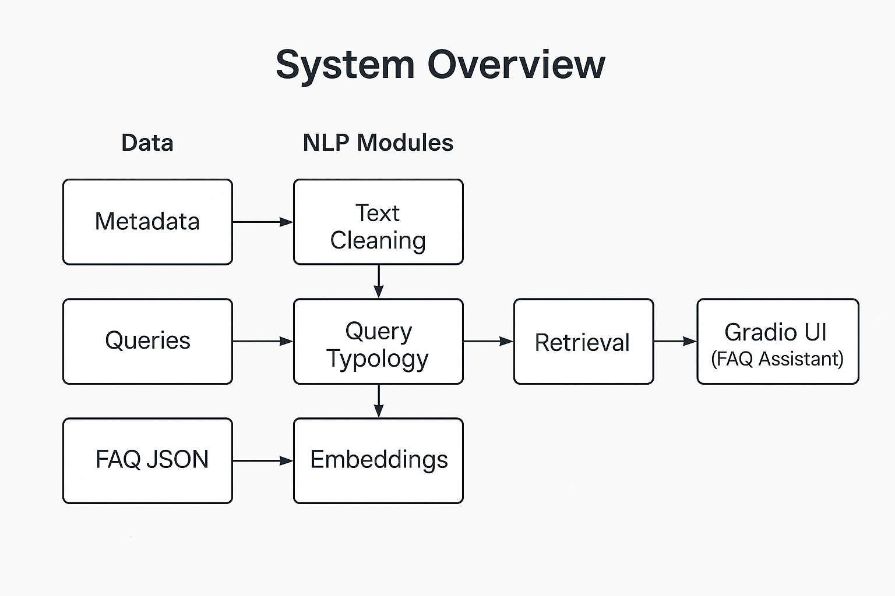

<p align="center">
  
</p>

<h1 align="center">KMS_lib — Smart Knowledge Management System</h1>
<p align="center">
  <em>Bridging Human Language and Knowledge Retrieval</em><br>
  <a href="docs/methodology.md">📘 Full Documentation</a> ·
  <a href="#how-to-run">⚙️ Quick Start</a> ·
  <a href="#demo">📊 Demo</a>
</p>

---

<p align="center">

  <!-- Build badge (GitHub Actions) -->
  <a href="https://github.com/Conyekp2/KMS_lib/actions/workflows/python-tests.yml">
    
  </a>

  <!-- Python version -->
  

  <!-- License -->
  

  <!-- Gradio -->
  

  <!-- Project status -->
  

</p>

---

## **Overview**

**KMS_lib** is a lightweight, open-source **Natural Language Processing (NLP)** framework for transforming unstructured academic data into structured, searchable knowledge.  
It uses **semantic embeddings**, **metadata normalization**, and **LLM-based query reformulation** to deliver precise, explainable answers through an interactive Gradio interface.

The system is designed for:
- **Academic libraries** and digital repositories  
- **Educational platforms** and AI-driven learning tools  
- **Researchers** exploring intelligent information retrieval  

---

## **Core Features**

| Feature | Description |
|----------|-------------|
| Modular Pipeline | Ingest → Embed → Retrieve → Converse architecture |
| Query Reformulation | Dual LLM setup (Ollama + Hugging Face) improves relevance |
| Synthetic Dataset | Metadata, Queries, and FAQs modeled on academic usage |
| Cultural Awareness | Reflects linguistic and cultural variation in academic language |
| Lightweight | Runs locally, CPU-friendly, no external APIs required |

---

## **Architecture Overview**

<p align="center">
  
</p>

**Pipeline Layers**
1. **Data Ingestion** — load, clean, and index academic metadata  
2. **Semantic Retrieval** — embed and rank documents using transformers  
3. **Conversational Interface** — query system via a Gradio chatbot  

---

## **Demo**

<p align="center">
  
  
</p>

> *User query:* “How can I reserve a book?” 
> *System reformulates & retrieves:* most relevant results with confidence scores.

---

## **How to Run**

```bash
# 1) Clone and enter the project
git clone https://github.com/Conyekp2/KMS_lib.git
cd KMS_lib

# 2) Create and activate a virtual environment
python3 -m venv .venv && source .venv/bin/activate

# 3) Install dependencies
pip install -r requirements.txt

# 4) (Optional) Small spaCy model used in examples
python -m spacy download en_core_web_sm

# 5) Run tests
pytest -q

# 6) Launch the Gradio app
python -m src.app.chatbot_gradio_app