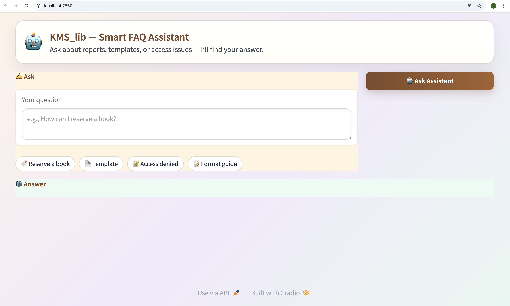
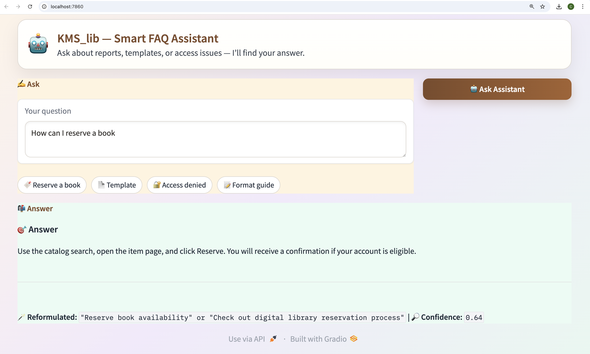

<p align="center">
  
</p>

<h1 align="center">KMS_lib — Smart Knowledge Management System</h1>
<p align="center">
 <em>Bridging Human Language and Knowledge Retrieval</em><br>
 <a href="docs/methodology.md">📘 Documentation</a> ·
 <a href="#how-to-reproduce">⚙️ Quick Start</a> ·
 <a href="#architecture-at-a-glance"> Architecture</a>
</p>


---


---


## **TL;DR**


**KMS_lib** is a lightweight, open source **Natural Language Processing (NLP)** framework designed to transform unstructured academic data into structured, searchable knowledge. 
It normalizes metadata, embeds text semantically, and reformulates user queries with **Large Language Models (LLMs)** to deliver precise, explainable answers through an elegant Gradio interface. 


Built with **Python**, **Sentence Transformers**, and **Gradio**, KMS_lib runs locally, requires no proprietary APIs, and ensures full data transparency. 
It serves both as a **research toolkit** and a **practical prototype** for academic libraries, repositories, and educational platforms seeking language-aware search and retrieval solutions.


---


## **Key Contributions**


1. **Modular NLP Pipeline** — Ingest → Embed → Retrieve → Converse architecture, independently testable and reusable. 
2. **Query Reformulation Layer** — Dual LLM setup (Ollama + Hugging Face) for clearer queries and higher retrieval precision. 
3. **Synthetic but Realistic Datasets** — Metadata, query, and FAQ corpora reflecting academic patterns while protecting privacy. 
4. **Validated Retrieval Flow** — Proven accuracy improvement through semantic embeddings and reformulation. 
5. **Cultural & Linguistic Awareness** — Reflects global academic communication styles and registers. 
6. **Reproducible & Open** — Fully documented environment, tests, and scripts for easy replication.


---


## **Design Principles**


- **Local-first and Privacy-preserving** — Runs offline; no external API calls. 
- **Explainable-by-Design** — Shows reformulated queries and top-k retrieval scores for transparency. 
- **Modular and Extensible** — Swap any layer (data ingestion, retrieval, or UI) easily. 
- **Inclusive Language Modeling** — Adapts to linguistic and cultural nuances. 
- **Resource-efficient** — CPU-friendly deployment; works on standard laptops. 
- **Reproducible Research** — Full environment reproducibility for academic integrity.


---


## **Research Framing and Problem Statement**


The exponential growth of digital content in education and research has led to what can be called the *knowledge fragmentation paradox*: institutions produce vast amounts of data reports, metadata, discussion threads, and FAQs yet users still struggle to locate accurate, contextualized information efficiently. Traditional search systems rely on rigid keyword matching and overlook linguistic and cultural context.


**KMS_lib** integrates **NLP**, **digital humanities**, and **knowledge organization** to address this gap. It explores how language-aware algorithms can transform scattered academic information into structured, discoverable knowledge assets. 
The central question guiding this work is: 
> *How can NLP and LLM technologies organize and retrieve academic knowledge in a context-aware, culturally inclusive, and institution-independent way?*


By focusing on linguistic diversity, interpretability, and local execution, *KMS_lib* offers a practical model for **responsible AI** in education—enhancing accessibility without compromising privacy.


---


## **Introduction**


The *Knowledge Management System Library (KMS_lib)* was conceived as an independent applied research project exploring how advances in **NLP** can improve how academic knowledge is structured and retrieved. It provides a **universal model** adaptable to libraries, educational startups, research repositories, and digital archiving teams. 


This research draws from years of experience in both **secondary and higher education**, where information often remains fragmented and inconsistently labeled. That reality inspired this exploration of **intelligent knowledge management**—structuring information so that it can be found, understood, and reused effectively.


*KMS_lib* bridges **academic research** and **real-world application**, transforming raw, unstructured data (like queries or FAQs) into searchable knowledge. It uses **synthetic datasets** modeled after real academic patterns—open, ethical, and reproducible—ensuring no proprietary or institutional data is exposed.


---


## **Method of Data Collation and Preparation**


The data design follows *representational authenticity*: building synthetic datasets that mirror academic language and structure while maintaining ethical openness.


### **Datasets**
- **Metadata samples** — structured bibliographic entries emulating institutional repository formats. 
- **User queries** — linguistically diverse academic search requests (short, ambiguous, and long). 
- **FAQ corpus** — curated Q&A dataset reflecting library and research support contexts.


### **Preprocessing**
Implemented with **Python**, **SpaCy**, and **Pandas**:
- Text normalization, tokenization, lemmatization 
- Stopword filtering, academic term correction 
- CSV/JSON storage for reproducibility 


### **Ethical, Linguistic & Cultural Considerations**
Beyond technical precision, the data reflects **linguistic and cultural nuances** in academic phrasing—tone, politeness, and register—to ensure inclusivity and realism.


---


## **Architecture at a Glance**


<p align="center">
  
</p>


The system follows three modular layers: 
1. **Data Ingestion** — validation and indexing of structured datasets. 
2. **Semantic Retrieval** — transformer-based embeddings for contextual matching. 
3. **Interaction Interface** — conversational UI using Gradio for real-time responses.


---


## **Demo**


<p align="center">
  
  
</p>


> *Sample query:* “How can I resreve a book?” 
> *System output:* Reformulated query + top results ranked by semantic similarity and confidence score.


---


## **How to Reproduce**


```bash
git clone https://github.com/<YOUR_USERNAME>/KMS_lib.git
cd KMS_lib
python3 -m venv .venv && source .venv/bin/activate
pip install -r requirements.txt
python -m spacy download en_core_web_sm
pytest -q
python -m src.app.chatbot_gradio_app